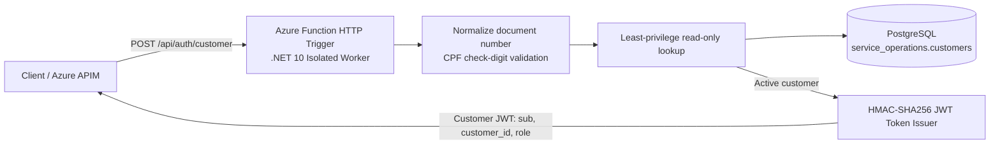

# CatCar - Auth Function (`catcar-auth-function`)

Serverless Azure Function responsible for customer authentication via CPF in the CatCar car repair shop management platform.

---

## Dedicated Serverless Authentication Architecture



The Function only authenticates active customer records. It normalizes the submitted CPF, rejects an invalid check digit before querying the database, uses the dedicated read-only connection for `service_operations.customers`, and issues a short-lived CatCar API JWT only after a successful lookup.

---

## API & Postman

- **Customer authentication endpoint:** `POST /api/auth/customer`
- **Interactive endpoint page (local Function host):** [http://localhost:7071/api/auth/customer](http://localhost:7071/api/auth/customer)
- **Platform Swagger UI:** [http://localhost:5000/swagger](http://localhost:5000/swagger)
- **Platform Scalar API Reference:** [http://localhost:5000/docs](http://localhost:5000/docs)
- **Versioned Postman collection:** [`CatCar_Platform.postman_collection.json`](https://github.com/RiseOn-CatCar/catcar-platform/blob/main/docs/postman/CatCar_Platform.postman_collection.json)
- **Postman environment template:** [`CatCar_Platform.postman_environment.json`](https://github.com/RiseOn-CatCar/catcar-platform/blob/main/docs/postman/CatCar_Platform.postman_environment.json)

Authenticate a customer directly against the local Function host:

```bash
curl --request POST http://localhost:7071/api/auth/customer \
  --header 'Content-Type: application/json' \
  --data '{"documentNumber":"529.982.247-25"}'
```

When testing the production routing boundary, submit the same request to the APIM base URL:

```bash
curl --request POST "$APIM_URL/api/auth/customer" \
  --header 'Content-Type: application/json' \
  --header "X-Correlation-Id: $(uuidgen)" \
  --data '{"documentNumber":"529.982.247-25"}'
```

## Project Structure

```
.
├── src/
│   ├── CatCar.AuthFunction/        # Azure Function Isolated Worker HTTP endpoints
│   └── CatCar.ServiceDefaults/     # Shared OpenTelemetry & resilience extensions
├── tests/
│   └── CatCar.AuthFunction.Tests/  # Unit tests for authentication and JWT claims
├── CatCar.AuthFunction.slnx        # Solution manifest
├── Directory.Build.props           # Common MSBuild settings
├── Directory.Packages.props        # Central Package Management (CPM)
├── Dockerfile                      # Multi-stage production container build
└── .github/workflows/ci-cd.yml     # Automated CI/CD pipeline
```

---

## Local Development & Testing

### Prerequisites
- .NET 10.0 SDK
- Docker (optional, for container runs)

### Build & Run Tests
```bash
# Restore dependencies
dotnet restore CatCar.AuthFunction.slnx

# Run unit tests
dotnet test CatCar.AuthFunction.slnx -c Release
```

---

## CI/CD Pipeline

- **Pull Requests**: Runs build and unit test suite.
- **Push to `develop`**: Builds and pushes container image to Azure Container Registry (ACR) and deploys to **Homologation** environment (`catcar-auth-function` Container App).
- **Push to `main`**: Builds and pushes container image to ACR and deploys to **Production** environment.
